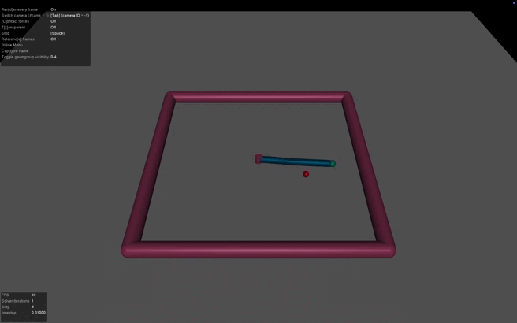

# SAC + HGR on Reacher-v5  

### LM: Artificial Intelligence & Robotics - Reinforcement Learning Project
[Fabrizio Italia](https://github.com/fabrizio-18)

Sapienza University of Rome, Italy  

## 📌 Introduction  
This repository implements the approach described in [*Hindsight Goal Ranking on Replay Buffer for Sparse Reward Environment*](https://arxiv.org/abs/2110.15043) by Tung M. Luu and Chang D. Yoo. 

The goal is to apply Hindsight Goal Ranking (HGR) to improve learning using the Soft Actor-Critic (SAC) algorithm in the [Reacher-v5](https://gymnasium.farama.org/environments/mujoco/reacher/) environment from Gymnasium.

Reinforcement learning in sparse reward environments is challenging since the agent rarely receives meaningful feedback.  
Hindsight Experience Replay (HER) overcomes the sample inefficiency problem in sparse reward environments: the idea is to relabel the goal of existing experiences in the replay buffer such that the episode is successful or in the future steps it is going to be successful.  

Hindsight Goal Ranking (HGR) is an extension of HER algorithm. It improves sample efficiency by prioritizing the future visited states within an
episode based on the TD error.

## ⌨️ How to run the code
1. Clone the repository:
```
git clone https://github.com/fabrizio-18/SAC-with-HGR-on-Reacher-v5.git
```
2. Navigate into the repository:
```
cd <path-to>/SAC-with-HGR-on-Reacher-v5
```
3. Train and evaluate the model:
```
python3 main.py -t -e --render
```
You can switch between standard Hindsight Experience Replay (HER) and the Hindsight Goal Ranking (HGR) model by commenting or uncommenting the specified lines in the code.

## 📊Results
| Algorithm  | Avg.Success Rate|
|------------|:-------------:|
| SAC + HER  | 99.07%         |
| SAC + HGR  | 99.13%         |


## 🎥 Video Results  


